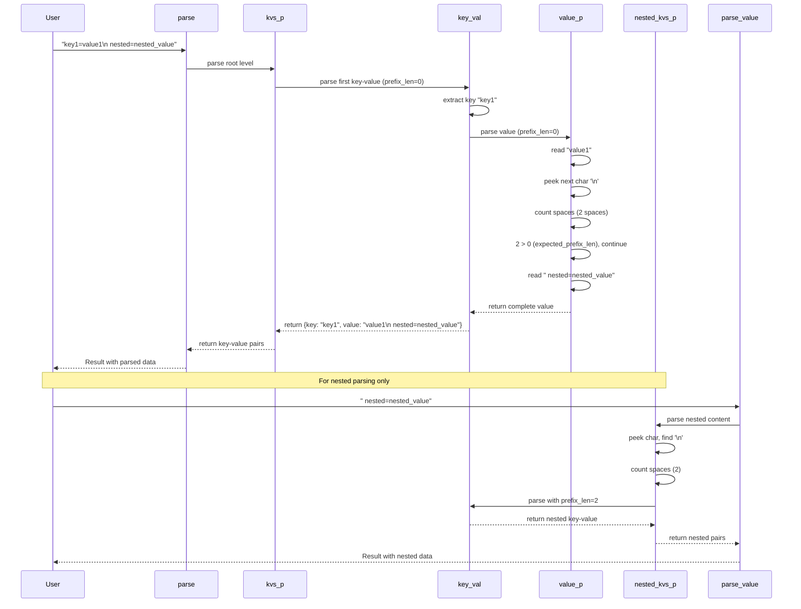

# CCL Parser Logic

## Sequence Diagram

## Key Decision Points

1. **Indentation Detection**: `value_p` counts spaces after newlines to determine if continuation
2. **Prefix Comparison**: If `spaces_len <= expected_prefix_len`, stop parsing (end of value)
3. **Nested Parsing**: `nested_kvs_p` calculates indentation level for nested key-value pairs
4. **Recursive Value Parsing**: `value_p` uses `fix` for self-referential parsing of multi-line values